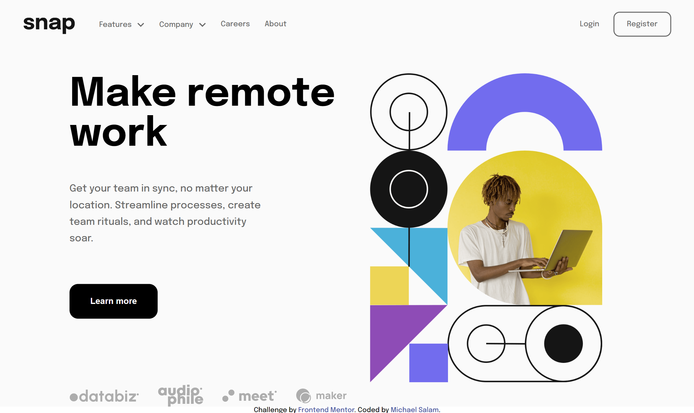
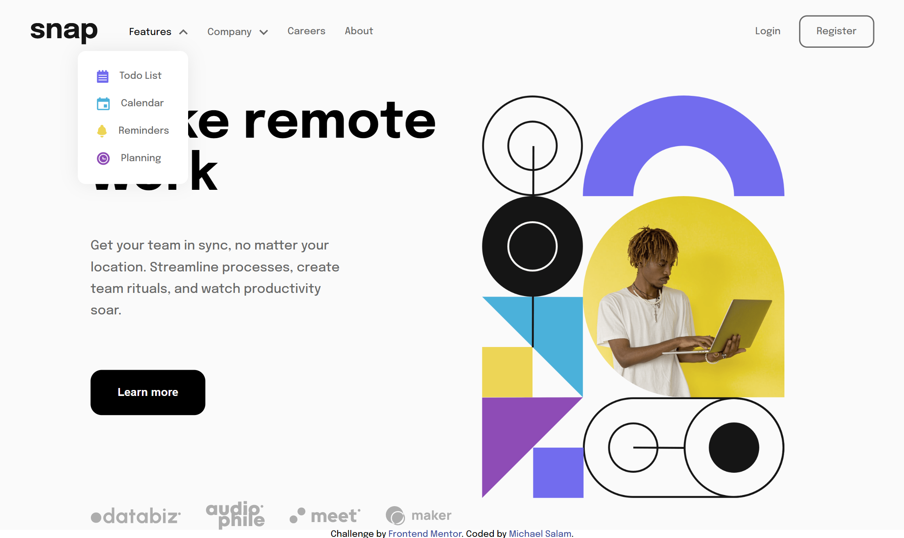
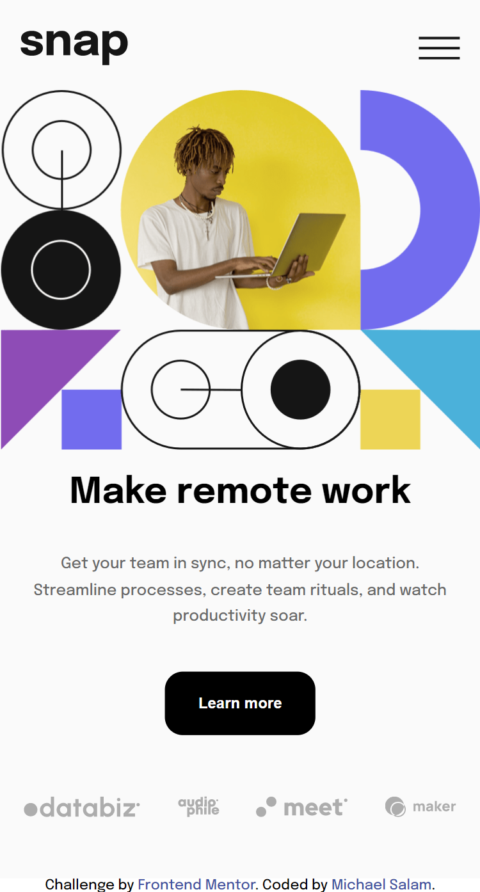
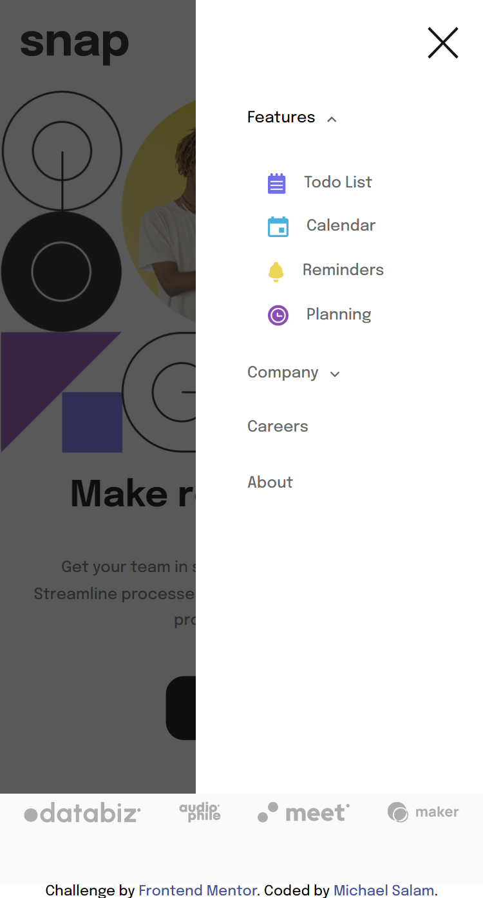

# intro-section-with-dropdown-navigation

Frontend Mentor challenge to build an intro section and implement a dropdown navigation

# Frontend Mentor - Intro section with dropdown navigation solution

This is a solution to the [Intro section with dropdown navigation challenge on Frontend Mentor](https://www.frontendmentor.io/challenges/intro-section-with-dropdown-navigation-ryaPetHE5). Frontend Mentor challenges help you improve your coding skills by building realistic projects.

## Table of contents

- [Overview](#overview)
  - [The challenge](#the-challenge)
  - [Screenshots](#screenshots)
- [My process](#my-process)
  - [Built with](#built-with)
  - [What I learned](#what-i-learned)
  - [Continued development](#continued-development)
  - [Useful resources](#useful-resources)
- [Author](#author)

**Note: Delete this note and update the table of contents based on what sections you keep.**

## Overview

### The challenge

Users should be able to:

- View the relevant dropdown menus on desktop and mobile when interacting with the navigation links
- View the optimal layout for the content depending on their device's screen size
- See hover states for all interactive elements on the page

### Screenshots

### Links

- Solution URL: [Github](https://github.com/michael-salam/intro-section-with-dropdown-navigation)
- Live Site URL: [Netlify site](https://intro-section.netlify.app)

## My process

### Built with

- Semantic HTML5 markup
- SCSS
- Flexbox
- Desktop-first workflow

### What I learned

One important thing I learnt is that you cannot add an overflow property on an absolutely displayed element unless the parent container has relative positioning. Who knew? 😂

### Continued development

Although this project has probably the best mobile menu I've ever built, there's still abit to improve on in the realm of mobile menus for me.

### Useful resources

- [Stack overflow](https://www.stackoverflow.com) - This helped me for XYZ reason. I really liked this pattern and will use it going forward.

## Author

- Website - [Michael Salam](https://michael-salam.netlify.app)
- Frontend Mentor - [@michael-salam](https://www.frontendmentor.io/profile/michael-salam)
- Twitter - [@michaeldimimu](https://www.twitter.com/michaeldimimu)
